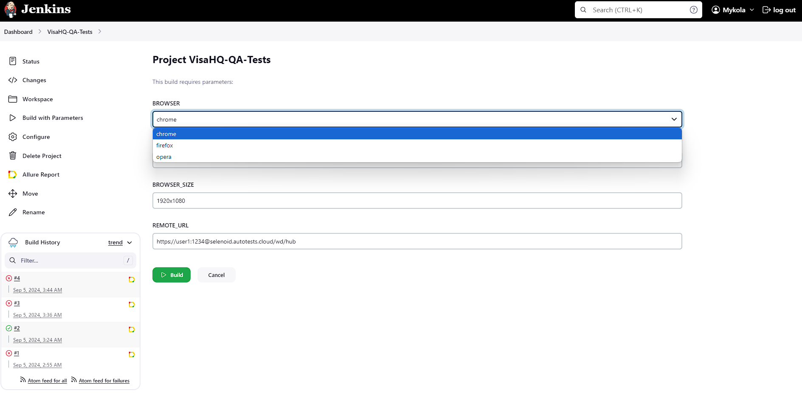
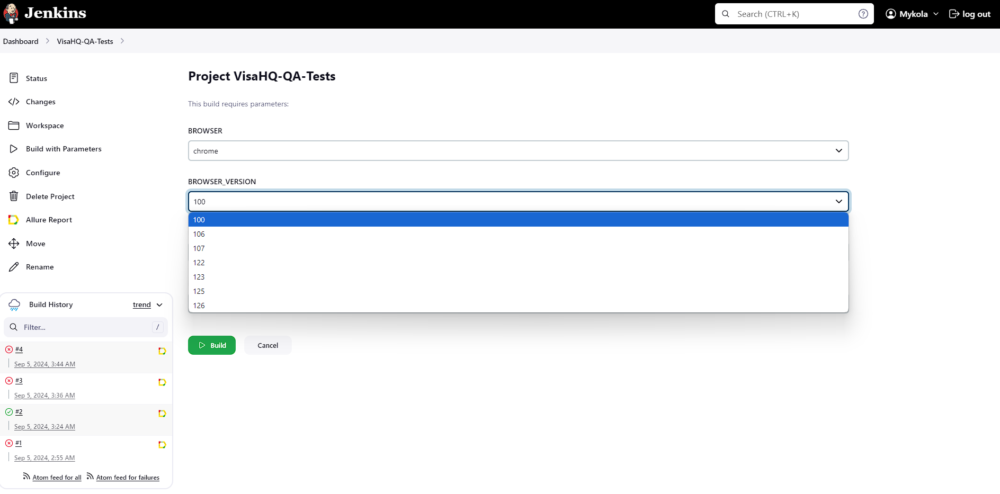
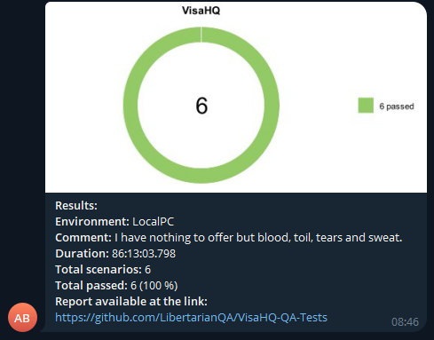
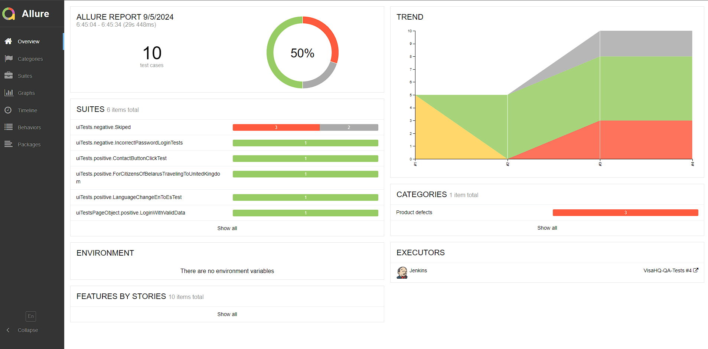
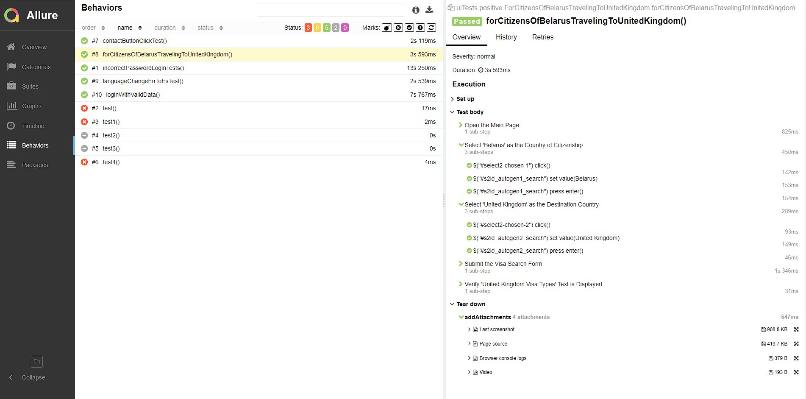
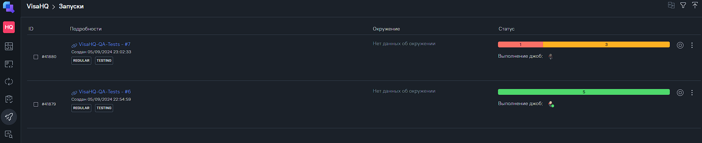
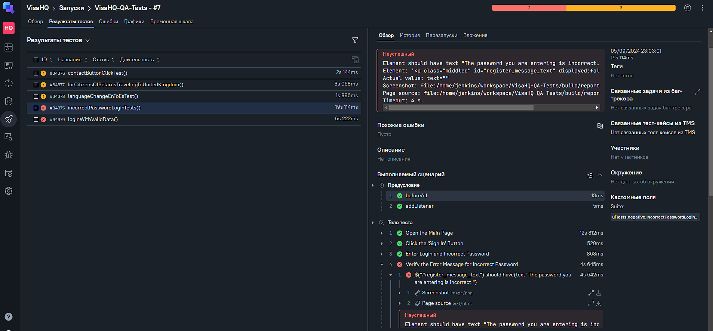
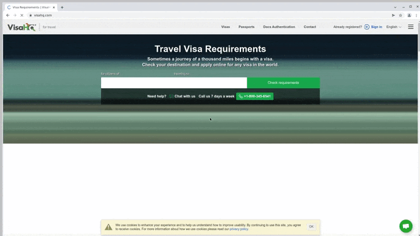

<h1 align="center">Test automation project for <a href="https://www.visahq.com/" target="_blank">VisaHQ</a></h1>

<p align="center">

</p>

> Since 2003 VisaHQ.com, Inc. has provided online visa services.\
> Take advantage of a personal touch - visit one of our 19 offices in 9 countries\
> for consultation and guidance by the VisaHQ team that speaks 19 languages.

# <a name="TableOfContents">Table of contents</a>

+ [Tools and technologies](#Technology)
+ [Implemented Checks](#ImplementedChecks)
+ [How to run](#HowToRun)
    + [Gradle command](#GradleCommand)
    + [Run in Jenkins](#RunInJenkins)
+ [Telegram Notifications](#TelegramNotifications)
+ [Test results report in Allure Report](#AllureReport)
+ [Allure TestOps integration](#AllureTestOps)
    + [Project in Allure TestOps](#AllureTestOpsProject)
    + [Test Cases](#TestCases)
+ [Video of running tests](#Video)

 <h1 align="center"> <a name="Technology">Tools and a technologies</a></h1>

<p align="center">
  <code></code>
  <code></code>
  <code></code>
  <code></code>
  <code></code>
  <code></code>
  <code></code>
  <code></code>
  <code></code>
  <code></code>
  <code></code>
</p>


[Back to the table of contents ⬆](#TableOfContents)

# <a name="ImplementedChecks">Implemented Checks</a>
- [x] Contact button click functionality test 
- [x] Travel information for citizens of Belarus traveling to the United Kingdom test
- [x] Language switch from English to Spanish test
- [x] Incorrect password login validation
- [x] Login with valid credentials test (`Page Object` with steps using `Chain of Invocations`)

[Back to the table of contents ⬆](#TableOfContents)

# <h1 align="center"> <a name="HowToRun">How to run</a></h1>

## <a name="GradleCommand">Gradle command</a>

To run locally the following command can be is used:

```bash
gradle clean test
```


[Back to the table of contents ⬆](#TableOfContents)

### Remote Test Execution

```bash
gradle clean test

-Dbrowser=${browser}
-DbrowserVersion=${browserVersion}
-DbrowserSize=${browserSize}
-DremoteUrl=${remoteUrl}
```

### Execution Parameters

<code>browser</code> – the browser in which the tests will be executed (default is - <code>chrome</code>).

<code>browserVersion</code> – the version of the browser (default is - <code>126</code>).

<code>browserSize</code> – the browser window size for test execution (default is - <code>1920x1080</code>).

<code>remoteURL</code> - the URL of the remote server where the tests will be run.

[Back to the table of contents ⬆](#TableOfContents)

## <a name="RunInJenkins">Run in [Jenkins](https://jenkins.autotests.cloud/job/VisaHQ-QA-Tests/)</a>

Main page of the build:
<p align="center">

</p>

A parametrized Jenkins job can be launched with needed ***parameters***:
<p align="center">

</p>

Sensitive config files are created in build workspace on build start.\
Relatively safe information transferred to the build by gradle arguments (see [Gradle command](#GradleCommand)
section, 'Additional parameters').

After the build is done the test results are available in:
>- <code><strong>*Allure Report*</strong></code>
>- <code><strong>*Allure TestOps*</strong></code> - results are uploaded there and the automated test-cases can be
   automatically updated accordingly to the recent changes in the code.


[Back to the table of contents ⬆](#TableOfContents)

<h1 align="center"> <a name="TelegramNotifications">Telegram Notifications</a></h1>

Telegram bot sends a brief report to a specified telegram chat by results of each build.
<p align="center">

</p>

[Back to the table of contents ⬆](#TableOfContents)

# <h1 align="center"><a name="AllureReport">Test results report in [Allure Report](https://jenkins.autotests.cloud/job/VisaHQ-QA-Tests/5/allure/)</a> </h1>

## Main page

Main page of Allure report contains the following blocks:

>- <code><strong>*ALLURE REPORT*</strong></code> - displays date and time of the test, overall number of launched
   tests, and a diagram with percent and number of passed, failed or broken tests
>- <code><strong>*TREND*</strong></code> - displays trend of running tests for all runs
>- <code><strong>*SUITES*</strong></code> - displays distribution of tests by suites
>- <code><strong>*CATEGORIES*</strong></code> - displays distribution of unsuccessful tests by defect types
<p align="center">
  
</p>

## List of tests with steps and test artefacts

On the page the list of the tests grouped by suites with status shown for each test.\
Full info about each test can be shown: tags, severity, duration, detailed steps.

Also additional test artifacts are available:
>- Screenshot
>- Page Source
>- Browser console log
>- Video

<p align="left">
  
</p>

[Back to the table of contents ⬆](#TableOfContents)

# <h1 align="center"> <a name="AllureTestOps">[Allure TestOps](https://allure.autotests.cloud/project/4422/launches) integration</a></h1>

## <a name="AllureTestOpsProject">Project in Allure TestOps</a>


In <code><strong>*Allure TestOps*</strong></code> , there is a feature that allows real-time monitoring of test execution.


  </p>


[Back to the table of contents ⬆](#TableOfContents)

## <a name="TestCases">Test Cases</a>


<p align="center">
  
</p>

[Back to the table of contents ⬆](#TableOfContents)

<h1 align="center"> <a name="Video">Video of running tests</a></h1>

<p align="center">
  
</p>AllureReportMain.png

[Back to the table of contents ⬆](#TableOfContents)